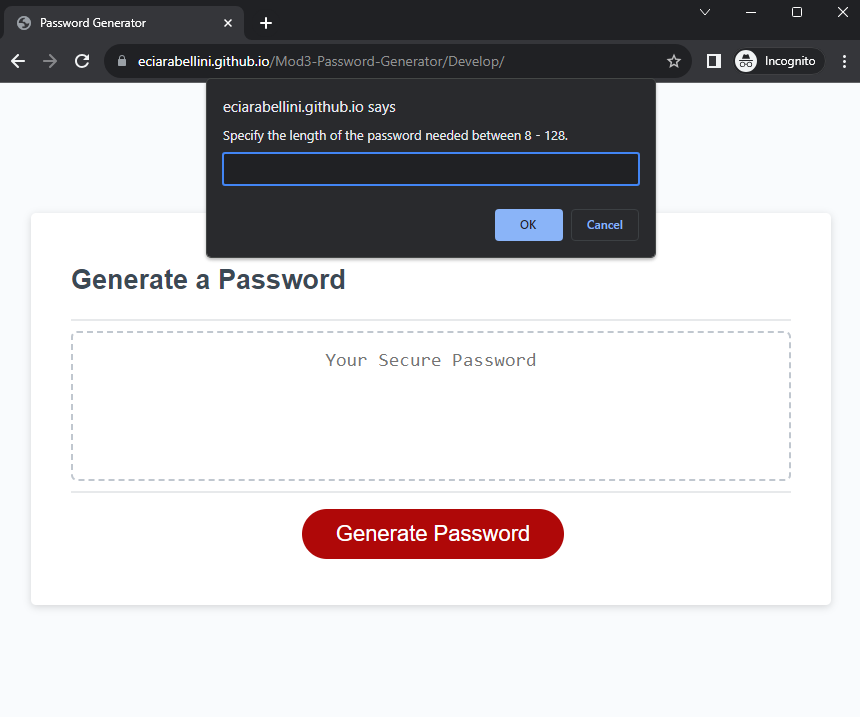
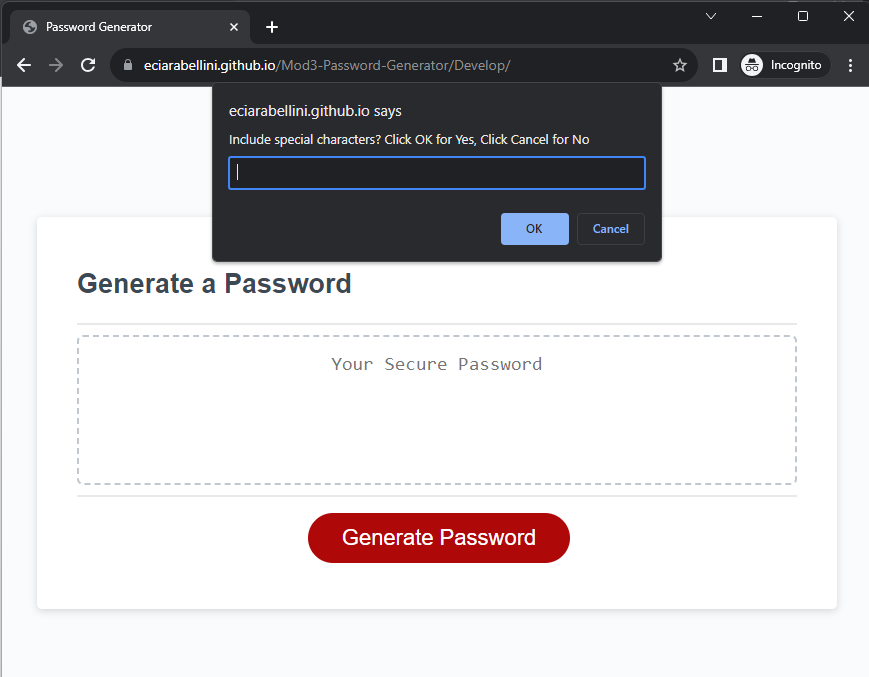
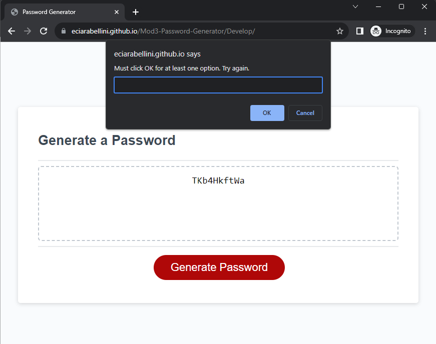
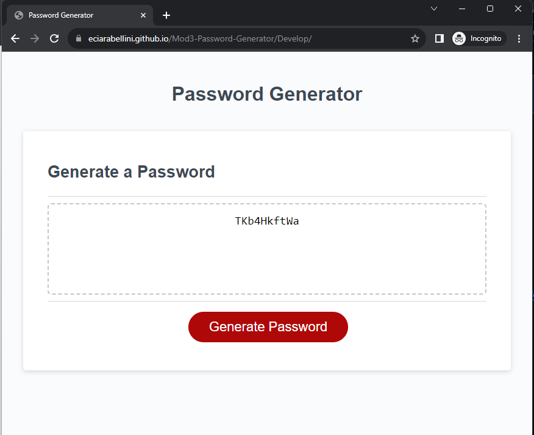

# Module 3: Password-Generator

## Description
This password generator takes inputs from the user and returns a random string of digits. It asks the user to choose a password legnth and options to include uppercase letters, lowercase letters, numbers, and special characters.

In creating the logic behind the password generation, I was able to practice basic user input validation with while loops. I also practiced array and string manipulation.

## Installation
[link](https://eciarabellini.github.io/Mod3-Password-Generator/Develop/)

## Usage

User specifies length within range  

User is provided options for characters to include  

If no options are selected, user is prompted to make a selection  

Once an option is selected, a random password is generated  

## Credits
index.html, style.css, and lines 1-19 in script.js file were provided to me by starter code from the coding bootcamp.

## License
MIT license
